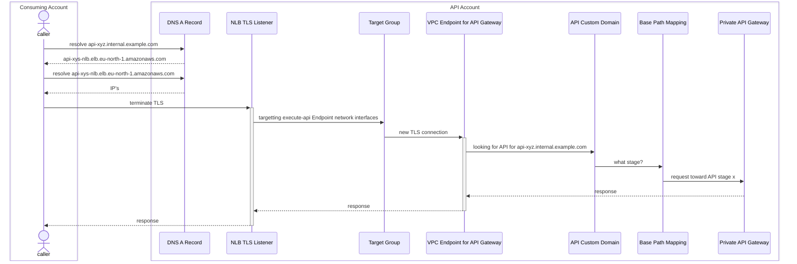
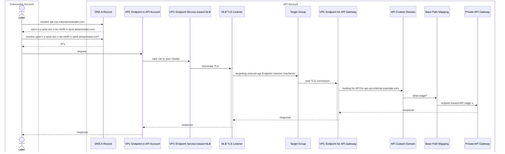
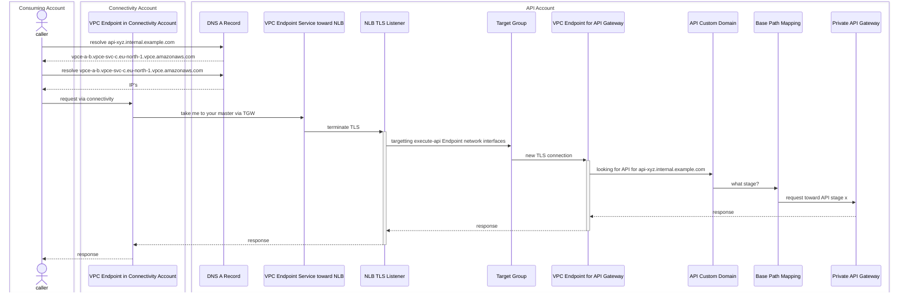

# terraform-aws-apigateway-custom-domain

This is intended to simplify the process of providing access to AWS API Gateway Private REST API's. It draws heavily upon the blog post [Enabling Private APIs with Custom Domain Names (AWS API Gateway)](https://georgemao.medium.com/enabling-private-apis-with-custom-domain-names-aws-api-gateway-df1b62b0ba7c) and the repository [serverless-samples/apigw-private-custom-domain-name](https://github.com/aws-samples/serverless-samples/tree/main/apigw-private-custom-domain-name) that draws heavily from that same blog post.

In addition, it provides an extra VPC Endpoint Service in the account so that the CNAME does not point directly to the load balancers which have IP addresses that are subject to change.

An implementer may also provide `vpc_endpoint_remote` that is the DNS of a VPC Endpoint created in another connectivity account. That would cause the DNS alias to point to that interface rather than the local interface created by this module.

## Usage

### Alias Direct to NLB

In its most simple form:

```terraform
module "this" {
  source = "theherk/apigateway-custom-domain/aws"

  api_id           = "jqr4abcdef"
  certificate_arn  = "arn:aws:acm:eu-north-1:123412341234:certificate/3f7ba345-30e0-481e-b513-f869b8834d42"
  domain_name      = "api.your.internal.domain"
  name             = "h4s-test"
  subnet_ids       = module.network.private_subnets[*].id
  vpc_endpoint_api = module.network.vpc_endpoint.api.id
  vpc_id           = module.network.vpc_id
  zone_id          = module.network.zones.internal.id
}
```

This is the most inexpensive and simple option provided by this module . It is also the most simple. Here, the alias record points directly to the NLB. If you don't need to route traffic through a connectivity account and you don't need to add the IP's to an allow list, this is probably fine.

_ref_: [Sequence Diagram](#alias-direct-to-nlb-sequence)

### Alias to VPC Endpoint in API Account

If one needs to add the request IP's to an allow list in a firewall, you shouldn't rely on the permanence of NLB's IP addresses. They change; sometimes not for a long time, but they change. In these cases, we put another VPC Endpoint Service in front of the NLB, then direct the DNS record toward a VPC Endpoint Interface that connects to that service.

```terraform
module "this" {
  source = "theherk/apigateway-custom-domain/aws"

  api_id             = "jqr4abcdef"
  certificate_arn    = "arn:aws:acm:eu-north-1:123412341234:certificate/3f7ba345-30e0-481e-b513-f869b8834d42"
  domain_name        = "api.your.internal.domain"
  name               = "h4s-test"
  subnet_ids         = module.network.private_subnets[*].id
  vpc_endpoint_api   = module.network.vpc_endpoint.api.id
  vpc_endpoint_local = true
  vpc_id             = module.network.vpc_id
  zone_id            = module.network.zones.internal.id
}
```

_ref_: [Sequence Diagram](#alias-to-vpc-endpoint-in-api-account-sequence)

### Alias to VPC Endpoint in Connectivity Account

In situations where your private network connections ingress from another account, assuming your have a TGW route covering both VPC's, you can first use `vpc_endpoint_local`. That will create the infrastructure above, but gives as an output `vpc_endpoint_service`. You can then use that to create a VPC Endpoint Interface in your connectivity account that targets the created `vpc_endpoint_service`. Giving this service back as `vpc_endpoint_service_remote`, will remove the local VPC Endpoint Interface and point the DNS record to the VPC Endpoint Interface in the connectivity account. Yielding the following sequence.

After having done the above with `vpc_endpoint_local = true`, create your VPC Endpoint Interface toward the output `vpc_endpoint_service`. Then modify the configuration to:

```terraform
module "this" {
  source = "theherk/apigateway-custom-domain/aws"

  api_id              = "jqr4abcdef"
  certificate_arn     = "arn:aws:acm:eu-north-1:123412341234:certificate/3f7ba345-30e0-481e-b513-f869b8834d42"
  domain_name         = "api.your.internal.domain"
  name                = "h4s-test"
  subnet_ids          = module.network.private_subnets[*].id
  vpc_endpoint_api    = module.network.vpc_endpoint.api.id
  vpc_endpoint_remote = "url-of-endpoint-created-in-connectivity-account"
  vpc_id              = module.network.vpc_id
  zone_id             = module.network.zones.internal.id
}
```

_ref_: [Sequence Diagram](#alias-to-vpc-endpoint-in-connectivity-account-sequence)

## Cost

Originally, this was designed with the ability to use existing load balancers and ALB path routing, but it was much more complex. So although if you look at the documents referenced and blog posts about this topic you'll find ALB is supported, for simplicity this module takes a much more opinionated approach. For each API custom domain, a new NLB is created and associated VPC Endpoints. This does incur some cost. This will likely be in the tens of dollars per month, but you should definitely check out the pricing pages for your region.

## Contributing

To work on this repository, you need to install the [pre-commit](https://github.com/pre-commit/pre-commit) hooks, and dependencies from [pre-commit-terraform](https://github.com/antonbabenko/pre-commit-terraform).

    make pre-commit

That should be the easy way, but if you use another package manager than `apt`, `brew`, or `yum` or want to configure these differently on your system, you can do so by following the guidance [here](https://github.com/antonbabenko/pre-commit-terraform#1-install-dependencies). For instance, you can set this up to use docker for running checks rather than installing directly to your filesystem.

After doing this, several checks will be run when attempting commits.

---

_note_: The following is generated by `terraform docs`.

<!-- BEGINNING OF PRE-COMMIT-TERRAFORM DOCS HOOK -->
## Requirements

| Name | Version |
|------|---------|
| <a name="requirement_terraform"></a> [terraform](#requirement\_terraform) | >= 0.15 |
| <a name="requirement_aws"></a> [aws](#requirement\_aws) | >= 3.64 |

## Providers

| Name | Version |
|------|---------|
| <a name="provider_aws"></a> [aws](#provider\_aws) | 5.41.0 |

## Modules

No modules.

## Resources

| Name | Type |
|------|------|
| [aws_api_gateway_base_path_mapping.this](https://registry.terraform.io/providers/hashicorp/aws/latest/docs/resources/api_gateway_base_path_mapping) | resource |
| [aws_api_gateway_domain_name.this](https://registry.terraform.io/providers/hashicorp/aws/latest/docs/resources/api_gateway_domain_name) | resource |
| [aws_lb.this](https://registry.terraform.io/providers/hashicorp/aws/latest/docs/resources/lb) | resource |
| [aws_lb_listener.this](https://registry.terraform.io/providers/hashicorp/aws/latest/docs/resources/lb_listener) | resource |
| [aws_lb_target_group.this](https://registry.terraform.io/providers/hashicorp/aws/latest/docs/resources/lb_target_group) | resource |
| [aws_lb_target_group_attachment.this](https://registry.terraform.io/providers/hashicorp/aws/latest/docs/resources/lb_target_group_attachment) | resource |
| [aws_route53_record.this](https://registry.terraform.io/providers/hashicorp/aws/latest/docs/resources/route53_record) | resource |
| [aws_security_group.api_endpoint](https://registry.terraform.io/providers/hashicorp/aws/latest/docs/resources/security_group) | resource |
| [aws_vpc_endpoint.api](https://registry.terraform.io/providers/hashicorp/aws/latest/docs/resources/vpc_endpoint) | resource |
| [aws_vpc_endpoint.local](https://registry.terraform.io/providers/hashicorp/aws/latest/docs/resources/vpc_endpoint) | resource |
| [aws_vpc_endpoint_service.this](https://registry.terraform.io/providers/hashicorp/aws/latest/docs/resources/vpc_endpoint_service) | resource |
| [aws_network_interface.this](https://registry.terraform.io/providers/hashicorp/aws/latest/docs/data-sources/network_interface) | data source |
| [aws_region.current](https://registry.terraform.io/providers/hashicorp/aws/latest/docs/data-sources/region) | data source |
| [aws_subnet.this](https://registry.terraform.io/providers/hashicorp/aws/latest/docs/data-sources/subnet) | data source |
| [aws_vpc_endpoint.api](https://registry.terraform.io/providers/hashicorp/aws/latest/docs/data-sources/vpc_endpoint) | data source |

## Inputs

| Name | Description | Type | Default | Required |
|------|-------------|------|---------|:--------:|
| <a name="input_allowed_principals"></a> [allowed\_principals](#input\_allowed\_principals) | Principals allowed to discover the VPC Endpoint Service. By default, principals outside the VPC will not be able to create interfaces to the Endpoint Service. | `list(string)` | `null` | no |
| <a name="input_api_id"></a> [api\_id](#input\_api\_id) | API to which the requests are destined. | `string` | n/a | yes |
| <a name="input_api_stage"></a> [api\_stage](#input\_api\_stage) | Name of the stage used for the base path mapping. | `string` | n/a | yes |
| <a name="input_certificate_arn"></a> [certificate\_arn](#input\_certificate\_arn) | ACM certificate to attach to the listener. | `string` | n/a | yes |
| <a name="input_domain_name"></a> [domain\_name](#input\_domain\_name) | Domain name to access api. This will point to the remote VPC Endpoint if `remote_vpc_endpoint` is given, or to a generated VPC Endpoint otherwise. | `string` | n/a | yes |
| <a name="input_domain_names_alternate"></a> [domain\_names\_alternate](#input\_domain\_names\_alternate) | Alternate domain names to access the api. These alternate names are for subject alternative names in the given certificate. | `list(string)` | `[]` | no |
| <a name="input_lb_enable_deletion_protection"></a> [lb\_enable\_deletion\_protection](#input\_lb\_enable\_deletion\_protection) | Boolean indicating if deletion protection should be enabled for the created load balancer. If `lb` is given, this is ignored. | `bool` | `null` | no |
| <a name="input_lb_log_bucket"></a> [lb\_log\_bucket](#input\_lb\_log\_bucket) | S3 bucket into which the created load balancer will store access logs. If `lb` is given, this is ignored. Even if `lb` is not given, this is not required. | `string` | `null` | no |
| <a name="input_name"></a> [name](#input\_name) | A name used to identify associated resources throughout, like endpoints and load balancer. | `string` | n/a | yes |
| <a name="input_subnet_ids"></a> [subnet\_ids](#input\_subnet\_ids) | Subnets for the target group. | `list(string)` | n/a | yes |
| <a name="input_vpc_endpoint_api"></a> [vpc\_endpoint\_api](#input\_vpc\_endpoint\_api) | VPC Endpoint for execute-api. If not given, one will be created. Given as an object, to avoid unknown until apply-time errors for variable data. | <pre>object({<br>    id = string<br>  })</pre> | `null` | no |
| <a name="input_vpc_endpoint_local"></a> [vpc\_endpoint\_local](#input\_vpc\_endpoint\_local) | Boolean indicating is a VPC Endpoint Interface should be created in the account with the API. If `false` and no `vpc_endpoint_remote` given, the DNS record will point directly to the NLB. This will be slightly less expensive, but it works. However, if you have any intention of using an IP allow list to allow traffic through a firewall, this may not be a good option since the IP addresses of NLB's can change unexpectedly. Ignored if `vpc_endpoint_remote` given. | `bool` | `false` | no |
| <a name="input_vpc_endpoint_remote"></a> [vpc\_endpoint\_remote](#input\_vpc\_endpoint\_remote) | VPC Endpoint in another connectivity account for calling the VPC Endpoint Service created in the API's account. If not provided, a second VPC Endpoint will be created in the API's account to point toward the VPC Endpoint Service which reaches the NLB. When added, the endpoint created in this account to reach the service will be removed. | `string` | `null` | no |
| <a name="input_vpc_id"></a> [vpc\_id](#input\_vpc\_id) | ID of the VPC. | `string` | n/a | yes |
| <a name="input_zone_id"></a> [zone\_id](#input\_zone\_id) | Zone into which the custom domain should be added. | `string` | n/a | yes |

## Outputs

| Name | Description |
|------|-------------|
| <a name="output_vpc_endpoint_service"></a> [vpc\_endpoint\_service](#output\_vpc\_endpoint\_service) | VPC Endpoint Service toward load balancer. This can be used to generate a VPC Endpoint Interface in another connectivity account. |
<!-- END OF PRE-COMMIT-TERRAFORM DOCS HOOK -->

## Sequence Diagrams

#### Alias Direct to NLB Sequence



#### Alias to VPC Endpoint in API Account Sequence



#### Alias to VPC Endpoint in Connectivity Account Sequence


